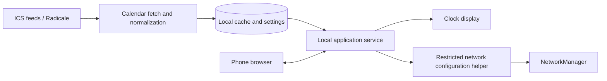

# Calendar Pie — project plan

Working draft, September 16, 2026. The overall plan and the clock decisions explicitly marked as confirmed below are approved by the user. Other proposed defaults remain design recommendations; no hardware performance results have been measured.

## Product

A round, always-visible calendar clock for understanding what is happening now, what comes next, and how much time remains. Inspired by the clock-face schedule visualization in [Sectograph](https://play.google.com/store/apps/details?id=prox.lab.calclock).

Confirmed hardware: Raspberry Pi Zero 2 W and Waveshare 4-inch round HDMI display with USB touch. Multiple read-only ICS calendars, individually configurable colors, touch event details, and a phone-accessible setup portal are in scope.

## Implementation status

The first local prototype is implemented with TypeScript and SVG, using Vite only for development/build tooling. It includes sample calendars, center time/date, an hour hand and active-or-next-event arc with an hours:minutes countdown, curved multiline event titles, radial overlap lanes, rolling 12/24-hour windows with configurable fading history, independent text preferences, local calendar colors, touch/keyboard event details, window navigation, a daily agenda, and a 720 × 720 circular kiosk layout. All-day events are filtered out. Enlarged slices include dark curved rims with white start/end times where space permits. An outer duration ring splits occupied time at every event boundary; selecting an overlapping interval opens an event chooser. Sample scenarios cover overlaps, the 30/15/45-minute duration split, overnight events, and an empty day.

The default sample is paused; live mode updates on minute boundaries. Preferences persist in browser storage. Rendering diagnostics and a Linux memory/swap sampler are available for the hardware experiment. The test suite covers rolling windows, title wrapping, countdowns, duration boundaries and overlap selection, curved rim times, fading-history settings, kiosk configuration isolation and rectangular settings dialogs, the 720 × 720 viewport, and live-clock updates. See [DEVELOPMENT.md](DEVELOPMENT.md) for validation commands and [hardware test instructions](HARDWARE-TEST.md).

The local Python/SQLite service is implemented: source CRUD, optional HTTP Basic authentication, bounded ICS recurrence normalization, background conditional refresh, atomic last-successful snapshots, sync errors, and a local JSON API. The clock can switch between real calendars and samples and manage sources through Settings. A Pi-side deployment script builds the interface, updates the Python environment, preserves application and browser data outside the checkout, and configures systemd user-service startup and recovery for both the application and a Chromium/Cage kiosk. See [backend setup and limits](BACKEND.md) and [deployment](DEPLOYMENT.md). Authentication and recurrence have fixture coverage, and authenticated Radicale collection feeds have been validated without storing private test data in the repository.

The target Pi/display combination has not completed the acceptance procedure, so hardware feasibility and renderer selection remain provisional. The service binds only to localhost. LAN authentication, appliance settings, and Wi-Fi provisioning remain later milestones. Combined Calendar Pie memory use and long-running reliability still need measurement.

Prototype boundary behavior: hide the countdown arc when its target is outside the selected window; retain next-event information in the desktop preview. On a DST transition window, hide event arcs and offer the agenda with UTC-offset time labels rather than draw ambiguous sectors. Full transition geometry remains deferred. Overlap lanes currently expand as needed; a capped overflow picker remains future work.

## Hardware and rendering decision

The Zero 2 W has a quad-core 1 GHz CPU, 512 MB RAM, mini HDMI, USB OTG, and 2.4 GHz Wi-Fi. The selected display is 720 × 720 and Waveshare explicitly shows it connected to a Zero 2 W. Budget for a mini-HDMI cable/adapter and USB OTG connection for touch; verify the complete display and Pi power arrangement before designing the enclosure. [Pi specifications](https://www.raspberrypi.com/products/raspberry-pi-zero-2-w/), [display specifications](https://www.waveshare.com/4inch-720x720-LCD.htm).

The drawing workload should be modest; browser memory overhead is the uncertainty. Raspberry Pi's current kiosk tutorial specifies at least 1 GB RAM, so a standard Chromium kiosk is outside that guide's hardware baseline. This does not establish that a tailored local page cannot work. [Official kiosk guide](https://www.raspberrypi.com/tutorials/how-to-use-a-raspberry-pi-in-kiosk-mode/).

Start with a bounded browser feasibility experiment on the actual Zero:

- Raspberry Pi OS Lite with only the graphical session needed by the browser.
- One local page, compiled static assets, local fonts, SVG clock, and no external assets.
- No continuous animation or second hand initially. Update time once per minute and immediately after resume or a time correction; redraw events only when necessary.
- Run the calendar service and exercise the setup page during the experiment, not just the clock page.
- Choose the OS architecture and browser package after checking current support on the actual image; record versions for reproducibility.

Proposed acceptance targets: visible touch response within 200 ms, at least 80 MB MemAvailable under normal peak workload, no sustained swapping, and a 24-hour run without crashes or increasing memory consumption. These are project targets, not predictions. Also check cold startup and reconnection after Wi-Fi loss.

If this fails, use a native Python/Pygame display with the same calendar service and web configuration portal. Pygame supplies drawing and fullscreen display primitives; actual memory, touch, and text quality still need testing. Do not build both complete renderers in advance. [Drawing API](https://www.pygame.org/docs/ref/draw.html), [display API](https://www.pygame.org/docs/ref/display.html).

## Proposed architecture

- Python service for calendar fetching, recurrence processing, the local API, and serving static pages. A small Flask application is a reasonable starting point; run one production service process without a development reloader.
- SQLite for calendar configuration, last successful snapshots, normalized events, and synchronization status. Keep secrets in files restricted to the service account and never return stored passwords to the UI.
- TypeScript and SVG for the initial browser face; HTML/CSS for event details and the responsive configuration portal. Build on the development machine, deploy static assets to the Pi.
- NetworkManager for network profiles, with narrowly scoped permission for the operations needed by setup. The calendar service and display run unprivileged.
- systemd starts and restarts services. Cached data remains usable without network access.

The native fallback only replaces the clock display. The configuration website runs in the user's phone browser and does not require a browser running on the Pi.

## Clock behavior

Appearance options implemented locally: subtle hour and half-hour radial guides; light and true-black (`#000000`) dark themes; bundled Inter and Open Sans, system fonts, and custom TTF/OTF/WOFF/WOFF2 import. Theme and font choices persist in browser storage. Custom font bytes stay in IndexedDB; bundled font licenses ship with the static build.

Separate two settings: dial span (12 or 24 hours per revolution) and text format (12-hour AM/PM or 24-hour time). Dial numerals follow text format; the 24-hour dial retains twelve numerals at two-hour intervals. In 12-hour format, full-size AM/PM suffixes mark noon, midnight, and the first and last chronological numerals around the rolling-window seam. In 24-hour format, time text uses unpadded hours (`0:05`, `9:30`). Hourly and half-hour grid lines, hourly stubs, ticks, ring outlines, and whole numeral labels share the event history fade; browsing another window or disabling history removes that fade. A thin line in the hourly-grid color marks the future boundary.

The configurable accent defaults to Madelena pink (`#C30052`) for the hand, countdown, focus indicators, branding, and active controls. Light mode uses pure white surfaces and black text; dark mode uses pure black surfaces and white text. Borders and grid lines use neutral gray. Calendar colors stay independent, with black slice labels and white times on dark rims. Hourly guides include stronger stubs beside the digits. Accent preferences persist with other appearance settings. Event details center their content and use the top close control without a redundant return button. The center omits the redundant format label when using 24-hour text.

Confirmed clock decisions: the center shows the current time and date as text; an arc from the hour hand to the next event shows time remaining until it starts; overlapping events use radial arcs; all-day events are hidden for now. The table includes these decisions and proposed defaults for the remaining behavior.

| Feature | Behavior |
| --- | --- |
| 12-hour face | Conventional hour positions with a rolling 12-hour window, including three hours of fading history by default. Swipe to browse adjacent windows with an explicit date and time range. |
| 24-hour face | A rolling 24-hour window, midnight at the top and noon at the bottom. History is configurable in whole hours from zero to one less than the dial span. |
| Current time | An hour hand marks the current position on the selected 12- or 24-hour dial, including progress within the hour. An ordinary minute hand can be evaluated in the prototype if it improves readability. |
| Event geometry | Start/end angles follow local clock time; clip to the selected window and mark continuation across its boundary. A one-hour event occupies 30 degrees on a 12-hour dial or 15 degrees on a 24-hour dial. |
| Calendar identity | Stable configured color per calendar, supported by text labels and a legend. |
| Event titles | Wrap across curved lines within each enlarged event slice. Narrow slices switch to upright radial text when it reveals more of the title or uses fewer lines; measure text and constrain it inside the slice body, clear of the time rim. Truncate only when the available lines are full. Dark curved rims show white start/end times when space permits; exact times remain available in details. |
| Duration ring | Split an outer ring at every event start/end boundary, with hours:minutes labels. Adjacent and overlapping events retain every boundary. Gaps between visible events show durations on dotted arcs; omit the gap containing now, unbounded leading/trailing space, and empty windows. Tap a segment for event selection or free-time details. The countdown stays on the main ring; hide duration segments containing any currently active event. |
| Overlapping events | Render overlapping events as arcs in separate radial lanes, retaining each calendar's color. Proposed overflow behavior: cap visible lanes and offer a list for crowded intervals. |
| All-day events | Hidden in this version, including badges, lists, and next-event selection. A future design may revisit Sectograph's treatment. |
| Very short events | Preserve their true visual duration; use a larger invisible touch target or a nearby event picker. |
| Center information | Current time and date in text. Center taps, holds, and keyboard input leave settings closed. Settings are available only from the desktop preview header. |
| Time remaining | Draw a clockwise arc from the hour hand to the current timed event's end, choosing the earliest ending active event during overlaps. With no active event, target the next timed event's start. Show an hours:minutes countdown on the arc (for example, 0:20), rounding positive remaining time up to the next minute. Hide the arc when its target is outside the displayed window or no target exists. |
| Event details | Title, calendar, date, start/end, duration, location, and scrollable plain-text description; large close control and optional inactivity return. |

Rolling windows keep upcoming events visible across noon and midnight. The default history is three hours, fading backward from now; setting history to zero removes past hours and the fade. Settings are available from the desktop header at the URL without `kiosk=1`. Kiosk mode has no settings entry point. Settings and calendar-source forms use rectangular dialogs that fit desktop and mobile browsers; event details and overlap selection remain circular.

Keep labels and controls inside the visible circle. A square screen layout will lose its corners. Prototype using a circular mask at the physical four-inch size, especially for event details and setup QR codes.

For daylight-saving transitions, retain actual instants for ordering and countdowns, and local wall times for clock geometry. Split events at offset changes; distinguish repeated-hour segments using lanes and offset labels. Show a transition indicator for skipped/repeated hours, and provide a chronological agenda when the dial is ambiguous. Define and test this before claiming complete timezone support.

Favor quiet visuals, clear empty time, strong contrast, and configurable text size. Avoid blinking or alarms by default. Treat usability for ADHD as something to evaluate with users, not a medical benefit established by the design.

## Calendar ingestion

Each calendar has a name, ICS URL, optional username/password, color, enabled state, and refresh interval. Start with a five-minute polling default plus manual refresh. Show last successful sync and individual source errors.

Radicale's collection GET implementation serializes a calendar collection, so authenticated collection URLs are a promising direct ICS source. Test one real calendar from the user's server early; use the collection URL, not the web UI URL or an individual event URL. Full CalDAV discovery and write support are unnecessary for this version. [Radicale GET implementation](https://github.com/Kozea/Radicale/blob/master/radicale/app/get.py).

Fetch on the Pi, keeping credentials out of the display and avoiding browser CORS constraints. Validate HTTPS certificates; make private-CA installation possible if needed. Permit LAN calendar servers intentionally.

Use `icalendar` for parsing and `recurring-ical-events` for bounded recurrence expansion. They divide parsing and occurrence calculation explicitly. Expand only a useful horizon, initially yesterday through the next seven days, with resource limits. [Library guide](https://recurring-ical-events.readthedocs.io/en/latest/user-guide/index.html).

Requirements include RRULE/RDATE/EXDATE, edited occurrences, cancellations, UTC and TZID times, embedded timezone definitions, floating times, all-day events, and events crossing midnight. Use the device timezone for floating times unless a source-specific override is set. Identity should include source calendar, UID, and recurrence occurrence. [iCalendar specification](https://www.rfc-editor.org/rfc/rfc5545).

Recognize all-day entries during ingestion so they can be excluded from display and next-event selection without affecting timed events in the same feed.

Replace a source's cached snapshot only after a successful fetch and parse; this also removes deleted events. Keep the previous snapshot on failures and indicate stale data. Honor conditional HTTP requests when supported; if a source returns the full feed every time, compare its content before reprocessing. Bound response size, fetch duration, and recurrence work so a large feed cannot freeze the clock.

## Setup and configuration

1. On first boot, display a setup Wi-Fi name, per-device password, and QR code. Start a protected setup hotspot.
2. The phone joins and opens a captive portal where supported. Always display a direct HTTP address as a fallback.
3. Collect home Wi-Fi SSID/password and timezone. Explain that setup Wi-Fi will disappear while the device attempts to join the home network.
4. If joining fails, restore the setup hotspot after a timeout and show a useful error. Judge Wi-Fi success by association and network configuration, not public internet reachability; a local-only Radicale network is valid.
5. After joining, show the LAN IP and a proposed `calendar-pie.local` address, subject to hostname availability. The phone reconnects to the home network to add/test ICS sources and set colors and clock preferences.
6. A deliberate on-device settings action can reopen setup mode later. A short network outage keeps the cached clock running and retries the saved connection.

Use the single radio in either setup AP mode or home Wi-Fi mode for the first version; do not depend on concurrent AP/client support. Zero 2 W Wi-Fi is 2.4 GHz only. [Pi specifications](https://www.raspberrypi.com/products/raspberry-pi-zero-2-w/).

NetworkManager provides hotspot creation, but a captive portal additionally needs DHCP/DNS configuration and HTTP handling for phone connectivity probes. Implement and test those separately, retaining the direct-address fallback. Do not intercept arbitrary HTTPS. [NetworkManager hotspot documentation](https://networkmanager.pages.freedesktop.org/NetworkManager/NetworkManager/nmcli.html).

Require a device-specific login for LAN configuration, protect state-changing requests, redact credentials from logs, and render calendar text safely. Disable the setup hotspot after successful provisioning. Configuration screens show connection errors without exposing stored secrets.

## Reliability

- Synchronize time over the network. After a cold boot without trusted time, show a time-not-synchronized state rather than a misleading schedule. Consider a battery-backed RTC if correct time after an offline power cycle is required.
- Keep cached calendars through temporary Wi-Fi or server outages and mark their age.
- Restart failed services automatically, bound logs and cache growth, and avoid writing state every clock tick.
- Make changes to settings atomic and preserve working Wi-Fi settings until replacement settings succeed.
- Treat brightness/backlight control as hardware-dependent until verified on this exact display; a dark theme alone does not turn off an LCD backlight.

## Build order and completion checks

1. **Hardware feasibility:** establish 720 × 720 output, USB touch alignment, stable power, and browser memory/latency results. Select the renderer here.
2. **Clock prototype:** synthetic events, colors, 12/24-hour geometry, radial overlap arcs, center time/date, active-event-end or next-event-start countdown arc, all-day filtering, and touch details. Evaluate legibility at actual size.
3. **Calendar service:** one real Radicale calendar, then multiple calendars; recurrence fixtures, timezone/DST cases, cancellation/deletion, and offline cache behavior.
4. **LAN configuration:** add/edit/test/delete sources, colors, timezone, dial/text format, and synchronization status from a phone.
5. **Provisioning:** setup hotspot, captive portal, successful join, wrong-password recovery, LAN-only network, and deliberate reconfiguration. Test Android and iOS portal behavior.
6. **Appliance finish:** boot directly to clock, crash recovery, reboot and outage checks, overnight run, then enclosure and cable routing.

The first complete release includes all six stages. Defer all-day event visualization, calendar editing, cloud accounts, alarm sounds, voice features, and elaborate animations.

Open product choices for prototype review: overlap lane styling, title legibility at physical size, time-remaining presentation beyond the displayed window, and whether an optional second hand or conventional minute hand helps. Implementation tests are available locally; no physical hardware benchmarks have been performed yet.
